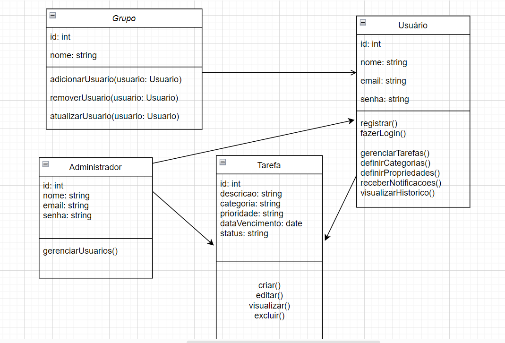
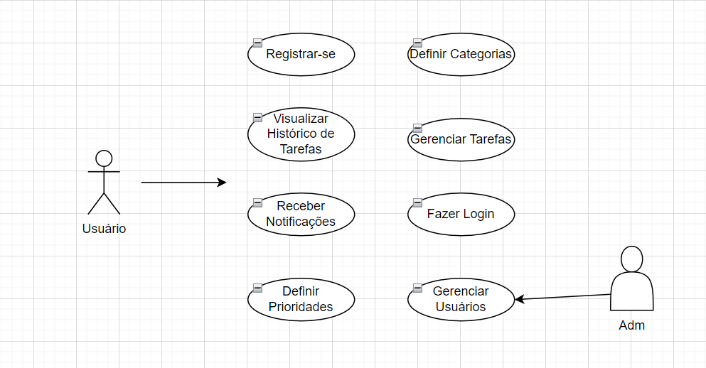
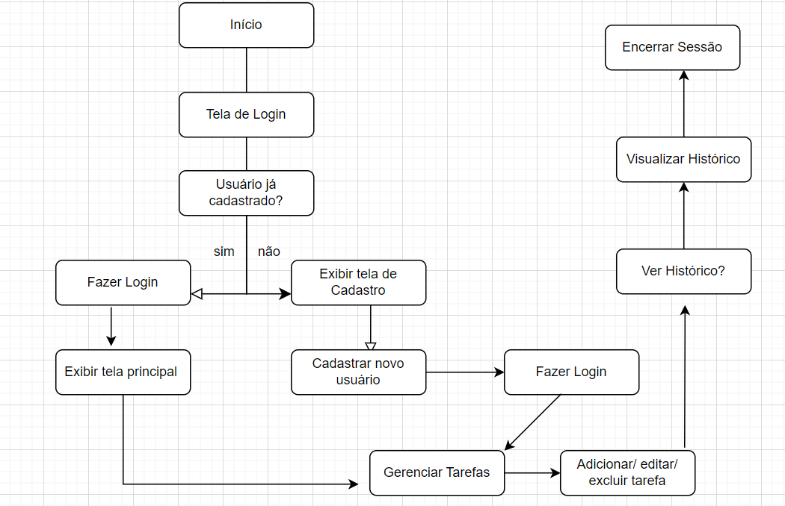

# Aplicação Web de To-Do List

## 1. Objetivos SMART

**Objetivo Específico**: Desenvolver uma aplicação web de To-Do List usando React, Node.js, MongoDB e JWT, que permita aos usuários criar, gerenciar e visualizar suas tarefas de forma eficiente e segura.

**Objetivo Mensurável**: Concluir o desenvolvimento da aplicação com as seguintes métricas:
- Implementar pelo menos 80% das funcionalidades previstas até a data final.
- Garantir que a aplicação passe em 95% dos testes de segurança e usabilidade realizados.
- Reduzir o tempo médio de resposta das ações da aplicação (criação, edição, exclusão de tarefas) para menos de 1 segundo.

**Objetivo Alcançável**: Com a equipe de desenvolvimento já familiarizada com as tecnologias propostas e o orçamento alocado para ferramentas e infraestrutura, a meta é realista e atingível dentro do prazo estipulado.

**Objetivo Relevante**: A aplicação atenderá à necessidade da Escola SENAI de oferecer uma ferramenta eficaz para a organização das tarefas dos colaboradores, alinhando-se à missão da escola de criar soluções educacionais eficientes.

**Objetivo com Prazo Definido**: Completar o desenvolvimento, testes e treinamento dos usuários até 30 de junho de 2025.

## 2. Cronograma

**Fase 1: Planejamento e Análise (2 semanas)**
- Reunião de kickoff e definição de requisitos: 01/09/2024 – 07/09/2024
- Análise de requisitos e elaboração de documentação técnica: 08/09/2024 – 14/09/2024
- Criação do plano de projeto e cronograma detalhado: 15/09/2024 – 21/09/2024

**Fase 2: Design e Arquitetura (3 semanas)**
- Design da interface do usuário (UI) e experiência do usuário (UX): 22/09/2024 – 28/09/2024
- Arquitetura da aplicação e definição da estrutura do banco de dados: 29/09/2024 – 05/10/2024

**Fase 3: Desenvolvimento (8 semanas)**
- Desenvolvimento do frontend (React): 06/10/2024 – 26/10/2024
- Desenvolvimento do backend (Node.js e MongoDB): 27/10/2024 – 16/11/2024
- Integração e implementação de autenticação JWT: 17/11/2024 – 23/11/2024

**Fase 4: Testes e Ajustes (4 semanas)**
- Testes unitários e de integração: 24/11/2024 – 30/11/2024
- Testes de segurança e performance: 01/12/2024 – 07/12/2024
- Ajustes e correção de bugs: 08/12/2024 – 14/12/2024

**Fase 5: Treinamento e Implementação (2 semanas)**
- Preparação de materiais de treinamento e documentação: 15/12/2024 – 21/12/2024
- Treinamento dos usuários e implantação da aplicação: 22/12/2024 – 28/12/2024

**Fase 6: Monitoramento e Suporte (2 semanas)**
- Monitoramento pós-lançamento e suporte inicial: 29/12/2024 – 04/01/2025
- Coleta de feedback e ajustes finais: 05/01/2025 – 11/01/2025

## 3. Análise de Risco

**Risco 1: Atrasos no desenvolvimento devido a problemas técnicos**
- **Impacto**: Pode atrasar o cronograma do projeto.
- **Mitigação**: Definir prazos realistas e realizar revisões periódicas do progresso. Implementar práticas ágeis para ajustar o desenvolvimento conforme necessário.

**Risco 2: Problemas com a segurança da aplicação**
- **Impacto**: Pode comprometer dados dos usuários e a integridade da aplicação.
- **Mitigação**: Adotar práticas de segurança desde o início, como criptografia, autenticação robusta e testes de segurança regulares.

**Risco 3: Baixa adoção da aplicação pelos usuários**
- **Impacto**: Reduz o impacto e a eficácia da aplicação.
- **Mitigação**: Incluir os usuários no processo de desenvolvimento e realizar treinamentos para garantir que a aplicação atenda às suas necessidades e seja fácil de usar.

**Risco 4: Orçamento excedente**
- **Impacto**: Pode afetar a viabilidade financeira do projeto.
- **Mitigação**: Monitorar os gastos regularmente e ajustar o escopo ou recursos conforme necessário para manter o projeto dentro do orçamento.

## 4. Recursos

**Recursos Humanos:**
- **Gerente de Projeto**: Responsável pela coordenação geral e pelo cumprimento do cronograma.
- **Desenvolvedores Frontend**: Focados no desenvolvimento da interface usando React.
- **Desenvolvedores Backend**: Responsáveis pelo desenvolvimento do servidor e integração com o MongoDB.
- **Especialistas em Segurança**: Para garantir a implementação adequada da autenticação JWT e segurança geral da aplicação.
- **Designers UX/UI**: Para criar uma interface amigável e intuitiva.
- **Equipe de Suporte e Treinamento**: Para preparar materiais e treinar os usuários finais.

**Recursos Materiais:**
- **Software de Desenvolvimento**: IDEs, ferramentas de controle de versão (Git), e ferramentas de design.
- **Servidores e Infraestrutura**: Servidores para hospedagem da aplicação e banco de dados MongoDB.
- **Licenças**: Licenças de software e ferramentas necessárias para o desenvolvimento e testes.

**Recursos Financeiros:**
- **Orçamento para desenvolvimento e testes**: Inclui salários da equipe, ferramentas de desenvolvimento e custos de infraestrutura.
- **Orçamento para treinamento e suporte**: Custos associados à preparação de materiais de treinamento e suporte inicial.

**Recursos Temporais:**
- **Tempo estimado para cada fase do projeto**: De acordo com o cronograma detalhado.
- **Disponibilidade da equipe e stakeholders**: Garantir que todos os envolvidos possam dedicar o tempo necessário para cumprir o cronograma.

## 5. Diagramas

